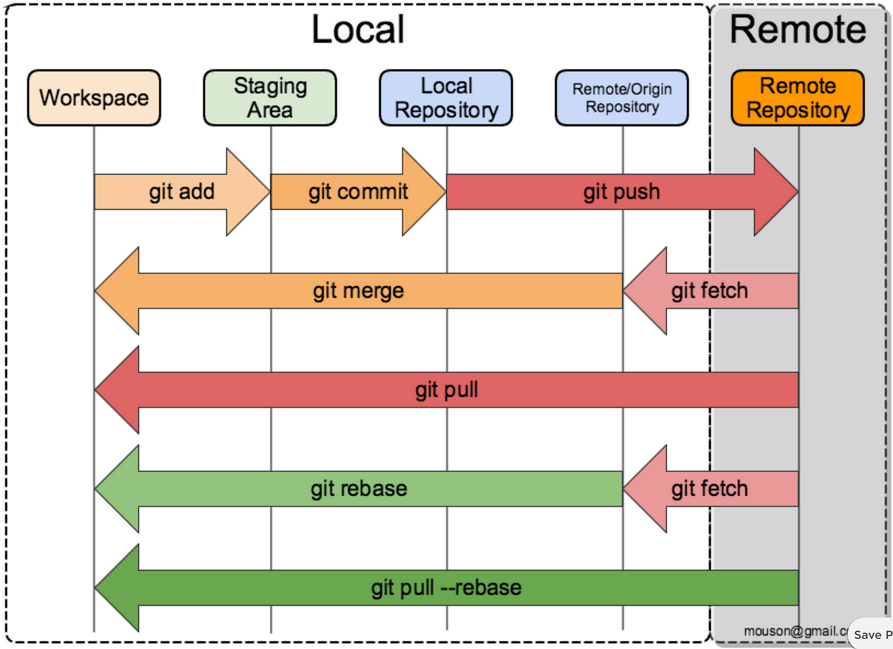

# Resumos Git e Github

Repositorio para armazenar resumos que eu n irei fazer :)

## 📘 Documentação 
- [Documentação Git](https://git-scm.com/doc)
- [Documentação GitHub](https://docs.github.com/pt)

## 💻 Resumos das aulas(que eu n vou fazer)
| Aulas | Resumos|
|-------|--------|
| iniciar repo | git init |

## ☝️🤓 Comandos que deu vontade de escrever para eu não esquecer
| Comando | Descrição |
|-------- | --------- |
| git init | inicializar repositorio |
| git status | mostra o status do repositorio (dificil essa, né?)|
| git config --global user.name <name> | armazenar o nome de usuario de forma global|
|git config --global user.email <email> | vc sabe o que faz|
| git config user.name | mostra o valor armazenado na variavel global|
| git config user.email | ta na duvida? da um google |
| git config --global defaultBranch <name>| define o nome da branch principal de forma global |
| git config --global --list | lista os valores armazenados nas variaveis globais (vale dizer que existem 3 tipos de acesso: global, system, local) |
| git clone <URL> | clona um repositorio, de boa se for publico e vai precisar de um token ou chave ssh para privado|
| git add <nome arquivo> | adiciona um arquivo **untracked**(não rastreado pelo git) que esta na area de workspace(obviamente) na area de staging, ou seja, na area de preparação |
| git add . | mesmo que o de cima só que adiciona todos os arquivos untracked |
| git commit -m "<mesagem>" | leva os arquivos da area de staging para a area do local repository(area anterior ao remote repository)|
| git log | mostra os commits |
| git restore <nome aqrquivo> | descarta todas as alterações feitas no arquivo no workspace para o estado do ultimo commit ⚠️CUIDADO|
| git commit --amend -m "<novo nome>" | renomeia o nome do ultimo commit|
| git reset --soft <hash do commit> | apaga os commits posteriores ao commit selecionado e envia as alterações deles para a área de staging |
| git reset --mixed <hash do commit> | apaga os commits posteriores ao commit selecionado e envia as alterações deles para a área de workspace |
| git reset --hard | apaga os commits posteriores ao commit selecionado e, obviamente, defaz as alterações |
| git reset <caminho(se tiver)/nome do arquivo> | remove da area de staging, voltando para o workspace |
| git restore --stage <caminho(se tiver)/nome do arquivo> | mesmo do de cima |
| git push -u origin <branch name> | envia os arquivos e commits da branch para o repositorio remoto |
| git pull | atualiza o repositorio local mesclando com o repositorio remoto(que explicacao bosta 🐯) |
| git checkout <nome da branch> | muda de branch |
| git checkout -b <nome da branch> | cria uma nova branch e muda para ela |
| git branch | mostra as branches|
| git branch -v | o de cima mais o commit que cada uma aponta |
| git branch -d <nome da branch> | apaga a brnach escolhida |
| git merge <nome da branch> | mescla as branches |
| git fetch | pega as alterações do repo remoto | 

## 😎 Funcionamento do git (não sei um nome melhor 🐯)

